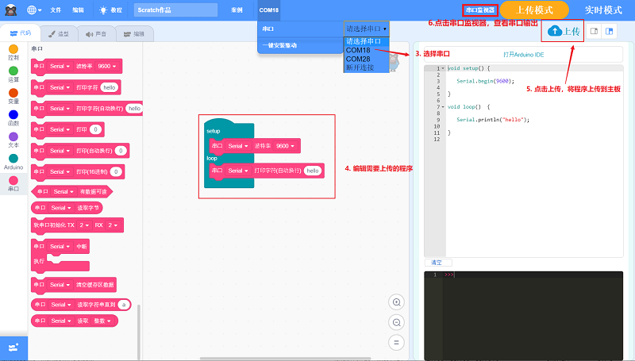
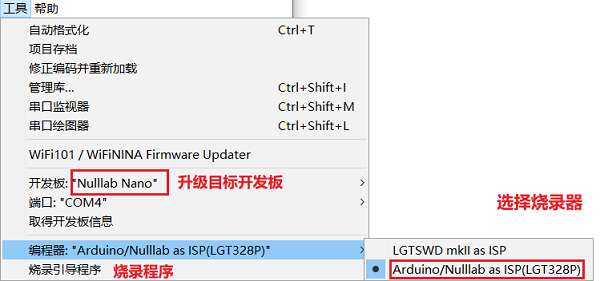

**[English](https://github.com/nulllaborg/arduino_nulllab/blob/master/README.md)**

## 写在之前

​    arduino uno R3自发布至今已有10多年，早已风靡全球，它的主控采用的是Atmel公司的Atmega328P主控，这是一颗基于AVR架构的8位单片机，面世有数十年了。得益于arduino完整软硬件生态，基于arduino uno的产品和项目不计其数。但是真正采用Atmega328P来量产的项目，却很少，因为这个芯片性价比很低。今年芯片缺货，导致对创客生态影响也很大，偶然的机会了解到[LogicGreen](http://www.lgtic.com/)的LGT8F328P，发现这是一款国产指令集兼容 AVR，Atmega328P的芯片，经过严格测试，发现能够99%兼容Arduino IDE。Nulllab团队是专门基于国产芯片做开发板的自由技术组织，为此我们专程拜访了LGT公司，和这颗芯片设计者详细了解到，这是一颗增强8位RISC内核，针对原来架构的做了优化，指令执行快了一些，同时优化了flash部分，增加定时器，内置晶振，反正就是把一些现代IC设计的一些主流技术应用在老的AVR框架上，出来也有5年多了，但是一直没怎么大规模应用，因为当时大家对国产的芯片天然不信任，以为这是山寨克隆版，实际这是一颗兼容芯片，类似于GD32之于STM32一样。LGT公司发展至今也早已有其他产品线，所以重心也没有全部放在兼容arduino的生态上，[官方SDK]()也在2019年后已经停止更新维护，[国外有个开源项目](https://github.com/dbuezas/lgt8fx)还在更新。nulllab技术团队大部分来自国际一线芯片原厂，已在创客开源软硬件行业沉浸多年。决定为国产创客软硬件生态做一点事情，我们先从LGT系类芯片做起，继续基于官方SDK做优化升级

## Nulllab软件包特点

​    官方sdk也好，还是国外另外一个软件包，其实都没有做到百分百之百兼容原生的arduino，特定应用还是存在有bug，nulllab团队致力于解决这些bug，并且把LGT8F328P相对于Atemag328P增加的功能添加进来，发挥这颗芯片的最大性能。那么对于小批量的产品而言，完全可以采用这个芯片来用Arduino IDE的方式开发产品，将大大简化开发难度。

打勾的代表已经实现并验证，没有打勾的代表正在开发中，期待更多开发者一起维护
- [x] [去掉停产D后缀系类的芯片](https://github.com/nulllaborg/arduino_nulllab/commit/48fd6c3)
- [x] [DIY模式支持主频选择](./lgt8f/cores/lgt8f/main.cpp#L126)
- [x] [DIY模式支持外部晶振配置选择](https://github.com/nulllaborg/arduino_nulllab/commit/9c7a2d9)
- [x] [ADC参考电压选择,默认10bit精度,兼容官方API](https://github.com/nulllaborg/arduino_nulllab/commit/78371c9)
- [x] [修复CH340G芯片下载程序概率失败](https://github.com/nulllaborg/arduino_nulllab/commit/577666d)
- [x] [精准延时](https://github.com/nulllaborg/arduino_nulllab/commit/7a9b5e)
- [x] (增强型功能) [兼容Arduino EEPROM API](https://github.com/nulllaborg/arduino_nulllab/commit/60e8c6d) DIY模式EEROM大小可以自由选择0,2,4,8KB 
- [x] [Arduino uno/LGT As ISP下载器使用](./libraries/Lgt328P_ISP/README.md)
- [ ] (增强型功能) [快速ADC]() )
- [ ] (增强型功能) [快速IO口]())
- [ ] (增强型功能)[2~6引脚80mA电流输出]())
- [ ] (增强型功能) [把AREF引脚当作A10]())
- [ ] (增强型功能) [低功耗电源管理]())
- [ ] (增强型功能)[ADC功能]()
- [ ] [软件串口适用所有频率]()

## Nulllab开发板Arduino IDE支持包 

安装包

使用前请确保有gitee账号并网页登录

1、文件->首选项，得到如下界面

2、在附加开发板管理器网址输入如下网址：
https://gitee.com/nulllab/nulllab_arduino/raw/master/package_nulllab_boards_index.json

3、工具->开发板->开发板管理
搜索nulllab,选择最新版本安装

4、开发板选择

## Mixly支持包
1、下载支持主板的[Mixly安装包](http://www.emakefun.com/uploads/software/Mixly_WIN.zip)

2、打开Mixly，按照下面提示即可以上传程序

## Magicblock（基于scratch3.0）图像化软件支持 
1、[下载MagicBlock](http://www.emakefun.com/uploads/software/MagicBlockSetup.exe)

2、安装好MagicBlock，并且打开MagicBlock

3、点击MagicBlock左下角的产品选择按钮，主板选择Nano Pro；

点击返回，即可以图形化编程。如下图

## 开发板

基于LGT8F328P系列主控做了5款款开发板分别针对于不同创客的应用场景

| 名字 | Nano V3.1                                                    | Nano Pro                                                     | Maker-Nano                                                   | Mango Uno                                                    | Orion                                                        |
| ---- | ------------------------------------------------------------ | ------------------------------------------------------------ | ------------------------------------------------------------ | ------------------------------------------------------------ | ------------------------------------------------------------ |
| 图片 |                                    |                                   |                                 |                                  |                                      |
| 参数 | CH340下载芯片 内部晶振 16M主频 PCB尺寸：50.8x25.4MM | CH340下载芯片 内部晶振 16M主频 PCB尺寸：50.8x25.4mm | 兼容官方驱动下载芯片 内部晶振 16M主频 PCB尺寸：56x32mm | 兼容官方驱动下载芯片 外部16M晶振 16M主频 PCB尺寸：68.6x53.4mm | 兼容官方驱动下载芯片 外部32M晶振 32M主频 PCB尺寸： |
| 特点 | 尺寸完全兼容官方arduino nano 3.0                             | Micro-Usb接口 功能尺寸兼容Nano V3.0 单面贴片            | 2路电机驱动(最大1.5A输出) 兼容乐高孔                    | 尺寸完全兼容官方arduino uno r3                               | 补强Uno IO口不够用情况，功能介于Uno和Mega2560之间            |
| 状态 | 已量产 [淘宝](https://item.taobao.com/item.htm?spm=a1z10.5-c-s.w4002-21257395099.47.1e64226e0PHZp6&id=650808111227) | 已量产 [淘宝](https://item.taobao.com/item.htm?spm=a1z10.5-c-s.w4002-21257395099.47.1e64226e0PHZp6&id=650808111227) | 准备量产                                                     | 准备量产                                                     | 开发中                                                       |

##  LGT8F328P和Atmega328P芯片对比

LGT8FX8P系列微控制器目前主要包括LGT8F328P, LGT8FX8P系列实现LGT8XP增强8位RISC内核, 支持16位数字运行扩展, 在1.8V – 5.5V的工作范围内, 可运行在最高32MHz的核心频率; LGT8F328P内部32K字节FLASH程序存储器, 2K字节数据SRAM, 内置将FLASH模拟为EEPROM的控制逻辑, 可以根据应用需要将程序FLASH的一部分划分为数据FLASH空间, 通过EEPROM控制器实现类似EEPROM的接口访问. LGT8F328P集成了丰富的模拟外设, 包括12位ADC, 可编程增益差分放大器, 高精度1.024/2.048/4.096V内部参考电压, 8位DAC以及高速模拟比较器; 同时LGT8F328P内部也集成了常用的数字接口控制器, 支持多路互补PWM输出以及死区控制。8F328P架构设计比较新，外设功能远远强于Atmel MEGA328。尤其是程序加密能力更是远超MEGA328。

## DIY模式说明

## 示例程序

- [SysClock](https://github.com/nulllaborg/arduino_nulllab/blob/master/libraries/BasicsExamples/examples/SysClock/SysClock.ino) - 外部晶振和系统时钟配置方法
- [AnalogRead](https://github.com/nulllaborg/arduino_nulllab/blob/master/libraries/BasicsExamples/examples/AnalogRead/AnalogRead.ino) - 12位ADC读取方法

### SysClock 配置

- **sysClock()**
	设置时钟晶振内部32K,32M,外部32K,400K,1M,2M,4M,6M,8M,12M,16M,32MHz
- **sysClockPrescale()**
	设置系统时钟分频系数0,2,4,8,26,42,64,128分频

### AnalogRead 读取

- **analogReference()**
  设置adc参考电压 
	DEFAULT 供电电压AVCC
	EXTERNAL 外部参考电压IOREF
	INTERNAL1V024 内部高精度1.024V
	INTERNAL2V048 内部高精度2.048V
	INTERNAL4V096 内部高精度4.096V
	
- **analogReadResolution()**
	设置adc精度有两种ADC10BIT和ADC12BIT默认精度是10bit
	
- **sysClockOutput()**
	1:使能D8引脚输出CPU系统主频 0:关闭D8输出

### EEROM操作

- **read_block(uint8_t *, uint16_t, uint8_t);  write_block(uint8_t *, uint16_t, uint8_t);**
    读写eerom数据到缓存
    
- **read32(uint16_t);  write32(uint16_t, uint32_t);**
    读写eerom 32bit数据
    
- **write_swm(uint16_t, uint32_t *, uint8_t);  read_swm(uint16_t, uint32_t *, uint8_t);**
	连续模式读写数据到缓存
	
	DIY模式可以

### [LGT8F328P as ISP](./libraries/Lgt328P_ISP/README_zh.md)

基于Atmega328P的Arduino Uno系类主板是可以给LGT8F328P系列烧录bootloard的，那么当然基于LGT8F328P的主板也同样可以给LGT8F32P系类芯片烧录bootloard的，他们的接线，烧录方法完全一致。

你的手里LGT系类主板或者arduino主板需要先烧录[Lgt328P_ISP](libraries\Lgt328P_ISP\Lgt328P_ISP.ino)程序然后参考[下载方法](./libraries/Lgt328P_ISP/README_zh.md)

